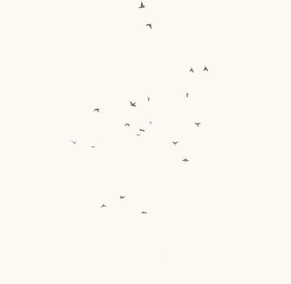
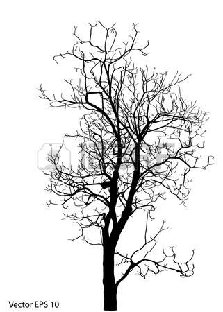

# giving-tree

###Overview
A JS canvas projects of birds flying around a tree and interacting with it and eachother. It is set to a #333 theme, 
very minimalistic. 

###Progress
Figuring out three.js. Yet to start designing tree/leaf layers in AI. 
###Live Preview
http://marge.stuy.edu/~jason.kao/Github/tree
